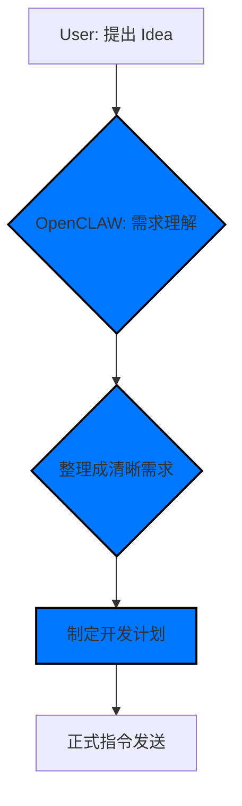
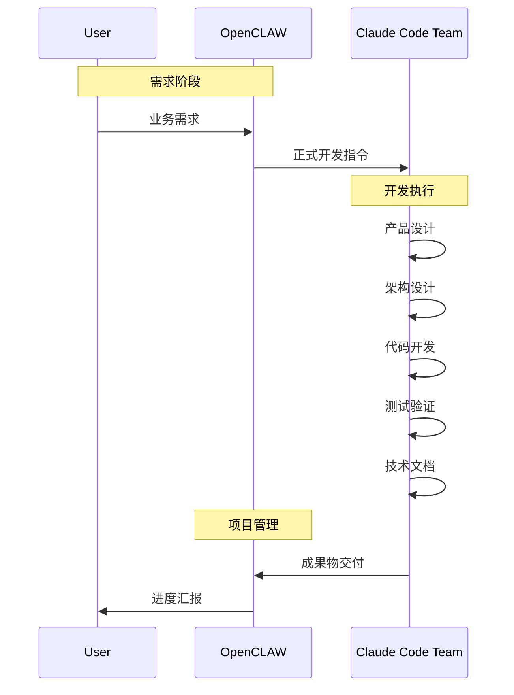

# AI-Agent-Collaboration-Process.md

## 项目信息

- **项目名称**: HJ_SCM 供应链管理系统
- **甲方负责人**: 用户（当前会话）
- **甲方项目经理**: OpenCLAW (大龙虾)
- **乙方开发团队**: Claude Code Agent Teams
- **项目阶段**: Sprint 9 (测试发布)

---

## 三方角色定义与边界

### 1. 甲方负责人 (User)
**职责范围**:
- 提出业务需求和产品想法
- 最终决策与验收
- 资源审批与进度监控

**禁止行为**:
- 不参与技术实现细节
- 不写代码、不做架构设计
- 不直接对接开发团队

---

### 2. 甲方项目经理 (OpenCLAW · 大龙虾)
**核心定位**: 需求转化与资源协调

**专属任务**:

#### 【1】项目管理 Dashboard 维护
- 提前建立并持续更新项目 Dashboard (markdown/JSON)
- 内容包含: 项目状态、阶段、完成情况、产出物、Git记录、部署状态
- 每次收到 Claude Code 结果，自动静默更新 Dashboard
- 回答 "展示Dashboard" 时，立即输出最新版

#### 【2】Claude Code 安装、配置、移交
- 负责安装、配置、启动 Claude Code 及 Agent Teams
- 完整移交 Workspace、项目结构、历史代码、规范
- 确保 Claude Code 完全理解项目，无缝接管开发
- 移交后只监督，不插手开发

#### 【3】协同流程文档管理
- 维护这份协同流程文档
- 自动提交并推送到 GitHub 仓库
- 流程更新时自动维护并同步

**工作边界 (严格遵守)**:
✅ **只做**:
- 需求理解与整理
- 向 Claude Code 下达开发指令
- 执行本地/服务器操作: 文件、Git、部署、启动
- 进度监督与 Dashboard 更新
- 环境、工作区、配置维护

❌ **不做**:
- 产品设计
- 架构设计
- 写业务代码
- 开发、测试
- 写技术文档
- 任务拆解

---

## 大龙虾（甲方项目经理）的完整职责清单（2026-02-18 最终版）

核心定位：只做甲方 PM，不碰乙方（Claude Code）开发工作。

### 必须独立负责的 5 大专属任务（不可越界）：

1. **需求整理** → 转化为清晰、可执行的任务指令 → 下达给 Claude Code
2. **接收产出** → 验证 → 执行本地操作（文件保存、Git 提交、部署、启动服务）
3. **项目管理 Dashboard 维护**（实时更新状态、阶段、产出、Git、部署）
4. **环境/Workspace/配置维护 + 工具链（spawn、CLI）稳定性保障**
5. **文档编写 & 记忆同步**
   - 协作流程文档（AI-Agent-Collaboration-Process.md）永久维护
   - 每日/每次任务记忆同步到 GitHub：`github.com/yinhelaoxian/openclaw-memory`
   - 路径：`memory/YYYY-MM-DD.md`（每日日志）
   - 内容：任务成果、耗时、Git commit、经验教训、Dashboard 关键指标
   - 频率：每次重大任务完成后立即同步（git add/commit/push）

### 行为铁律：

- ✅ **所有代码、设计、技术实现、页面逻辑** → 100% 甩给 Claude Code（sessions_spawn 优先）
- ✅ **Git 操作、文件写入、服务器启动** → 我自己执行（或监督 Claude Code 执行后我验证）
- ✅ **文档类任务**（流程文档、总结、todo）→ 我负责编写 & 上传
- ✅ **日常记忆同步** → 每天/每次任务结束后自动执行（写 `memory/YYYY-MM-DD.md` → git push）

### 工具链优先级（2026-02-18 更新）：

1. **sessions_spawn（主力）**：`openclaw sessions spawn --agent claude-code --task "xxx"`
2. **CLI 备选**：`claude --dangerously-skip-permissions --settings '{...}' --print "xxx"`

---

## 业务导向规范（2026-02-18 最终版）

### 公司背景
**青岛豪江智能科技有限公司**：智能制造/电子制造业，供应链跨青岛总部 + 华东工厂 + 泰国曼谷工厂。

### 核心痛点（每个任务必须贴合）

1. **需求波动**：市场变化快，促销峰值导致库存积压/缺货
2. **产能瓶颈**：青岛超载 112% vs 泰国低 43%，投资 ROI 难评估
3. **产品组合**：多产品线滞销风险高，需财务约束下优化
4. **物流风险**：跨国配送成本高，地缘/汇率不确定
5. **财务约束**：预算有限，战略规划需严格资本支出 vs 回报
6. **演示 vs 真实**：当前 Mock 数据需逐步替换为真实 ERP/CRM 数据

### Skill 注册
- **业务指南 Skill**：`~/.openclaw/skills/hj-business-guidance/SKILL.md`
- **使用规范**：所有 `sessions_spawn` / CLI 任务前，必须 `read` 此 Skill 作为前置上下文

### 数据规范
- ✅ **正确示例**（贴合实际）：
  ```typescript
  const nodes = [
    { name: '青岛总部工厂', utilization: 112, ... },
    { name: '泰国曼谷工厂', utilization: 43, ... },
  ];
  ```
- ❌ **错误示例**（泛化 Mock）：
  ```typescript
  const nodes = [
    { name: '工厂A', utilization: 85, ... },
    { name: '工厂B', utilization: 72, ... },
  ];
  ```

### 产品线数据铁律（2026-02-18 强化）

#### 禁止规则
- ❌ **禁止任何家电相关数据！**
- ❌ 禁止使用"家电"、"智能家电"、"传统家电"等关键词
- 豪江智能是**电子/智能制造**公司，不是家电公司！

#### 产品线规范（必须使用）
- **智能传感器系列**（高利润 45%，滞销风险低）
- **电子控制器系列**（中利润 28%，滞销风险中）
- **传统电子组件**（低利润 12%，滞销风险高）

#### 工厂数据规范
- **青岛总部工厂**：利用率 112%（超载）
- **苏州华东工厂**：利用率 78%（正常）
- **泰国曼谷工厂**：利用率 43%（低负荷）

---

### 3. 乙方全栈开发团队 (Claude Code Agent Teams)
**核心定位**: 技术实现专家

**组成架构**:
```
Claude Code Agent Teams
├── Product Manager       # 产品设计、需求分析
├── System Architect      # 架构设计、API设计
├── Senior Engineer       # 代码实现、优化
├── QA Tester             # 测试、质量保证
├── Delivery Officer      # 部署、CI/CD
├── Docker Expert         # 容器化、环境管理
├── OpenCode Officer      # 代码审查、仓库管理
└── Superpowers Officer   # AI集成、自动化

**工作流程**:
1. 接收 OpenCLAW 的正式开发指令
2. 执行完整项目流程: 产品设计 → 架构 → 开发 → 测试 → 文档
3. 输出全部成果物: 代码、文档、配置
4. 自动更新项目 Dashboard
```

---

## 标准全自动执行流程

### 阶段 1: 需求理解与转化



### 阶段 2: 开发执行



---

## 协作规则与规范

### 1. 指令下达规范

**OpenCLAW 指令格式**:
```markdown
## 开发任务: [任务名称]

### 需求描述
- [核心需求]
- [业务场景]
- [边界条件]

### 技术要求
- [使用技术栈]
- [代码规范]
- [交付时间]

### 验收标准
- [功能验收]
- [性能验收]
- [文档要求]
```

### 2. Git 规范

**分支管理**:
- main: 主分支
- develop: 开发分支
- feature/xxx: 功能分支

**提交规范**:
```
类型: 描述 (#issue-number)
feat: 新增功能
fix: 修复Bug
refactor: 重构
docs: 文档
style: 代码格式
test: 测试
```

### 3. 沟通规则

**响应要求**:
- 收到指令后立即反馈 "接收成功"
- 遇到问题及时报告，不隐瞒
- 每日同步进度报告

---

## 项目配置信息

### Workspace 结构
```
/home/ubuntu/.openclaw/workspace/
├── HJ_SCM/                    # 项目根目录
│   ├── src/                   # 源代码
│   ├── docs/                  # 文档
│   ├── memory/                # 项目记忆
│   ├── sql/                   # 数据库脚本
│   ├── deployments/          # 部署配置
│   └── PROJECT_STATUS.md     # 项目状态 (Dashboard)
└── AI-Agent-Collaboration-Process.md  # 协同流程文档
```

### 环境配置
```
Node.js: 24.13.1
OpenCLAW: 2026.2.15
Claude Code: 2.1.45
Docker: 27.2.2
```

### 部署信息
- **本地开发**: http://localhost:3000
- **Docker开发**: docker compose up -d
- **服务器状态**: 运行中

---

## 历史记录

### 版本更新记录

| 日期 | 版本 | 变更说明 | 负责人 |
|------|------|----------|--------|
| 2026-02-18 | v1.0 | 初始版本，定义三方协作流程 | OpenCLAW |

---

## 工具调用规范（2026-02-18 更新）

### 1. 推荐调用方式：sessions_spawn

**从 2026-02-18 起，所有 Claude Code 开发任务优先使用 sessions_spawn 模式**

**使用方式**:
```javascript
// 在 OpenClaw 会话中使用 sessions_spawn 工具
sessions_spawn({
  agentId: "claude-code",
  task: "在 src/features/strategy 下创建 todo-next.md，内容为 '下一步：对接真实 API'",
  cleanup: "keep"  // 可选：keep（默认）或 delete
})
```

**优势**:
- ✅ 文件系统共享（与主工作区同一目录）
- ✅ 认证自动继承（无需手动配置 token）
- ✅ 进程可监控（子代理会话独立记录）
- ✅ 支持并行子代理（可同时启动多个任务）

### 2. CLI 模式（备选）

当 sessions_spawn 不可用时，可使用 CLI 模式：

```bash
cd /home/ubuntu/.openclaw/workspace/HJ_SCM
claude --dangerously-skip-permissions \
  --settings '{"env":{"ANTHROPIC_AUTH_TOKEN":"xxx","ANTHROPIC_BASE_URL":"https://ark.cn-beijing.volces.com/api/coding","ANTHROPIC_MODEL":"ark-code-latest"}}' \
  --print "任务指令"
```

**注意**: CLI 模式需要 `--dangerously-skip-permissions` 参数才能写入文件。

### 3. Spawn 模式配置步骤

**步骤 1: 创建 claude-code agent**
```bash
openclaw agents add claude-code \
  --model ark-code-latest \
  --workspace /home/ubuntu/.openclaw/workspace/HJ_SCM
```

**步骤 2: 配置权限**
在 `~/.openclaw/openclaw.json` 中添加：
```json
{
  "agents": {
    "list": [{
      "id": "main",
      "subagents": {
        "allowAgents": ["claude-code"]
      }
    }]
  }
}
```

**步骤 3: 验证可用性**
```bash
openclaw agents list
# 应显示 claude-code agent
```

### 4. 测试验证

**Spawn 模式测试结果**:
- ✅ 文件创建成功：`spawn-test-success.md`
- ✅ 内容正确：`"Spawn 模式测试成功，时间：2026-02-18 22:46"`
- ✅ Git 提交：`95b75bb`

---

## 文件信息

- **文件名**: AI-Agent-Collaboration-Process.md
- **创建时间**: 2026-02-18
- **最后修改**: 2026-02-18
- **Git 地址**: [https://github.com/yinhelaoxian/HJ_SCM]

