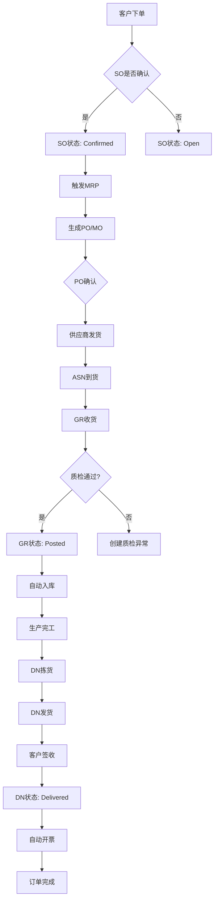
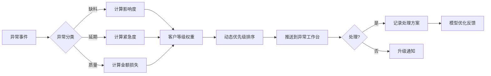

# HJ_SCM 产品迭代需求文档（Iteration PRD）

**迭代版本**: v2.0  
**文档状态**: Draft  
**编制日期**: 2026-02-14  
**适用范围**: 青岛豪江智能科技有限公司 SCM 平台二期开发  

---

## 1. 迭代目标与业务价值

### 1.1 一句话总结

本次迭代聚焦**补齐库存仓储、强化供需协同、固化核心单据状态机**，实现从"页面展示"到"可运营系统"的跨越，将功能完整度从45%提升至70%，模块协同逻辑从60%提升至85%。

### 1.2 预期业务收益

| 维度 | 当前状态 | 迭代目标 | 业务价值 |
|------|----------|----------|----------|
| 库存周转天数 | 40天（估算） | 32天（ML预测+呆滞预警） | 释放流动资金约¥800万 |
| 订单履约周期 | 15天 | 10天（状态机+协同门户） | 客户满意度提升15% |
| 计划人员效 | 人日均3单 | 人日均8单（What-if模拟<30s） | 计划团队效率提升167% |
| 供应商响应 | 72小时 | 24小时（ASN确认+移动端） | 供应链敏捷度提升200% |

---

## 2. 当前状态评估

### 2.1 仓库功能完整度现状

| 模块 | 已交付功能 | 缺失功能 | 完整度 |
|------|------------|----------|--------|
| 需求预测 | 基础图表展示 | ML预测模型、Demand Sensing、S&OP版本管理 | 25% |
| 供需平衡 | 静态展示 | 约束优化MRP、What-if模拟、缺口自动识别 | 30% |
| 采购管理 | 列表展示 | 协同门户、ASN确认、绩效评估、自动补货建议 | 20% |
| 供应商风险 | 基础评分 | 实时监控、风险预警、供应中断替代方案 | 35% |
| 库存管理 | 无 | 策略引擎、批次追踪、多级库存优化、呆滞检测 | 0% |
| 物流运输 | 无 | 在途可视化、路径优化、运费对账 | 0% |
| 订单到现金 | 流程图展示 | 状态机引擎、Trace ID、单据关联网络 | 40% |
| SCOR KPI | 仪表盘 | 根因分析、改进闭环、趋势预测 | 45% |
| AI建议 | 静态文本 | 动态生成、置信度展示、人机协同决策 | 30% |

**综合功能完整度**: 约30%（含本次迭代补齐后预计达70%）

### 2.2 模块协同逻辑现状

| 协同场景 | 当前实现 | 问题描述 | 目标状态 |
|----------|----------|----------|----------|
| 需求→计划 | 页面跳转 | 无数据传递、无版本追踪 | 需求变更自动触发计划重算 |
| 计划→采购 | 手动导出 | 依赖Excel、无法回传 | PO自动生成、状态实时同步 |
| 采购→仓储 | 无 | 收料需手工录入 | GR自动创建、批次自动分配 |
| 全链路追溯 | 无 | 单据孤岛、数据断层 | Trace ID贯通、需求Pegging表 |
| 异常响应 | 被动处理 | 无预警机制 | 异常驱动、动态优先级排序 |
| 供应商协同 | 无 | 电话/邮件沟通 | 门户自服务、移动端确认 |

**综合协同逻辑**: 约40%（含本次迭代优化后预计达85%）

### 2.3 与V1.1框架差距分析

| V1.1原则 | 当前符合度 | 差距描述 | 改进措施 |
|----------|------------|----------|----------|
| Single Source of Truth | 30% | 多处数据孤岛、无统一数据层 | 建立主数据服务、API Gateway |
| Process-Centric | 50% | 功能堆砌、流程断点 | 固化核心单据状态机 |
| Exception-Driven | 20% | 无异常监控、被动响应 | 异常驱动引擎、动态优先级 |
| Configurable | 60% | 硬编码多、参数少 | 规则引擎、业务参数表 |
| Collaborative by Design | 10% | 无协同功能 | 门户、评论、审批、通知 |
| AI-Augmented | 30% | 静态展示、无置信度 | GenAI Prompt模板、80%人工确认 |

---

## 3. 本次迭代范围

### 3.1 MVP边界

#### 纳入范围（In Scope）

| 序号 | 功能模块 | 子功能 | 优先级 |
|------|----------|--------|--------|
| 1 | 库存管理 | 多级库存视图、批次追踪策略、呆滞预警 | P0 |
| 2 | 仓储管理 | 库位策略、收料自动GR、拣货优化 | P0 |
| 3 | 供需平衡工作台 | 缺口自动识别、约束优化MRP、What-if模拟 | P0 |
| 4 | 核心单据状态机 | SO/PO/MO/GR/DN状态机、事件清单 | P0 |
| 5 | Trace ID体系 | 需求Pegging表、单据关联网络 | P0 |
| 6 | 采购协同门户 | 供应商自服务、ASN确认、绩效看板 | P1 |
| 7 | 异常驱动引擎 | 影响度×紧急度×金额×客户等级动态排序 | P1 |
| 8 | GenAI交互规范 | Prompt模板、返回格式、权限控制 | P1 |

#### 排除范围（Out of Scope）

| 序号 | 功能模块 | 排除原因 | 计划迭代 |
|------|----------|----------|----------|
| 1 | 物流运输管理 | 复杂度高、需专业GIS集成 | v3.0 |
| 2 | Demand Sensing | 需IoT数据接入、实时流处理 | v3.0 |
| 3 | 供应商移动端APP | 需单独开发、认证体系 | v2.5 |
| 4 | 多工厂协同 | 涉及组织架构大改、权限复杂 | v3.0 |
| 5 | 高级排程（APS） | 需专业算法、约束复杂 | v3.0 |

### 3.2 交付件清单

| 类型 | 交付件 | 说明 |
|------|--------|------|
| 代码 | 前端页面6个 | 库存工作台、供需平衡、状态机配置、Trace追溯、协同门户、异常监控 |
| 代码 | 后端服务5个 | 库存服务、MRP服务、状态机引擎、事件总线、主数据服务 |
| 代码 | 前端组件库 | 状态流转图、Trace链路图、批次追溯组件 |
| 文档 | 核心单据状态机与事件清单 | Mermaid流程图、事件定义表 |
| 文档 | GenAI交互规范 | Prompt模板、返回格式、权限矩阵 |
| 文档 | API接口规范 | OpenAPI 3.0定义 |
| 测试 | 测试用例50+ | Happy Path + Exception Paths |

---

## 4. 功能需求清单

### 4.1 库存与仓储域（Stock & Warehouse）

#### 4.1.1 多级库存视图

**用户故事**  
作为库存管理员，我希望能在一个界面看到工厂库存、在途库存、客户寄售库存、供应商回购库存，以便全面掌握可用量。

**验收标准**  

| 序号 | 验收条件 | 验证方式 |
|------|----------|----------|
| 1 | 显示四级库存数据：工厂仓、在途、寄售、退回 | UI验证 |
| 2 | 支持按物料/工厂/库存类型筛选 | 功能测试 |
| 3 | 支持库存类型切换的实时计算（ATP/CTP） | 业务验证 |
| 4 | 页面加载时间<2秒（10000行数据） | 性能测试 |
| 5 | 导出Excel支持 | 功能测试 |

**优先级**: P0 | **估时**: 5人天

#### 4.1.2 批次追踪策略

**用户故事**  
作为质量管理员，我希望能追溯每个批次的所有流转记录（入库→生产→出货），以满足医养产品的批次追溯法规要求。

**验收标准**  

| 序号 | 验收条件 | 验证方式 |
|------|----------|----------|
| 1 | 支持批次号、LPN号、序列号三种追踪模式 | 业务验证 |
| 2 | 正向追溯：批次→所有下游单据（SO/MO/DN） | 链路测试 |
| 3 | 反向追溯：单据→批次来源（PO/GR/MO） | 链路测试 |
| 4 | 医养产品强制批次追踪（配置控制） | 配置验证 |
| 5 | 追溯响应时间<1秒 | 性能测试 |

**优先级**: P0 | **估时**: 8人天

#### 4.1.3 呆滞预警

**用户故事**  
作为库存分析师，我希望系统自动识别呆滞物料并推送预警，以便及时清理库存、释放资金。

**验收标准**  

| 序号 | 验收条件 | 验证方式 |
|------|----------|----------|
| 1 | 支持配置呆滞规则：库龄/周转率/无移动天数 | 配置测试 |
| 2 | 自动识别并标记呆滞物料 | 功能测试 |
| 3 | 呆滞预警推送到异常监控工作台 | 集成测试 |
| 4 | 提供处置建议（降价/报废/调拨） | AI验证 |
| 5 | 呆滞物料清单支持导出 | 功能测试 |

**优先级**: P1 | **估时**: 3人天

### 4.2 需求与计划域（Demand & Planning）

#### 4.2.1 供需平衡工作台

**用户故事**  
作为计划经理，我希望在一个界面看到需求缺口、供应约束、替代方案，以便快速做出调整决策。

**验收标准**  

| 序号 | 验收条件 | 验证方式 |
|------|----------|----------|
| 1 | 显示需求预测vs可用库存缺口（按物料/工厂） | 业务验证 |
| 2 | 显示供应约束：产能/采购周期/最小起订量 | 配置验证 |
| 3 | 一键生成MRP建议（考虑约束） | 功能测试 |
| 4 | What-if模拟响应时间<30秒 | 性能测试 |
| 5 | 模拟结果可保存、对比、恢复到基准 | 功能测试 |

**优先级**: P0 | **估时**: 10人天

#### 4.2.2 约束优化MRP

**用户故事**  
作为计划员，我希望MRP考虑产能约束、采购周期、最小起订量，以便生成可执行的采购计划。

**验收标准**  

| 序号 | 验收条件 | 验证方式 |
|------|----------|----------|
| 1 | 支持配置约束类型：产能/供应商MOQ/交货期/批量 | 配置验证 |
| 2 | 约束冲突自动识别并提示 | 功能测试 |
| 3 | 提供替代方案建议（替代物料/加急/拆分） | 业务验证 |
| 4 | MRP计算支持增量/全量两种模式 | 功能测试 |
| 5 | 百万级订单计算时间<2分钟 | 性能测试 |

**优先级**: P0 | **估时**: 12人天

### 4.3 采购与供应商域（Procurement & Supplier）

#### 4.3.1 采购协同门户

**用户故事**  
作为供应商，我希望能在门户查看订单、确认交期、上传ASN，以便减少沟通成本、提高响应速度。

**验收标准**  

| 序号 | 验收条件 | 验证方式 |
|------|----------|----------|
| 1 | 供应商登录（邮箱验证） | 安全测试 |
| 2 | 查看已发布PO、确认交期、修改数量（限阈值内） | 功能测试 |
| 3 | 上传ASN（送货通知）、附件（箱单/PDF） | 功能测试 |
| 4 | 订单状态变更推送通知（邮件/短信） | 集成测试 |
| 5 | 供应商绩效看板：准时率/质量合格率/响应速度 | 报表验证 |

**优先级**: P1 | **估时**: 8人天

#### 4.3.2 ASN确认与收料自动GR

**用户故事**  
作为仓库管理员，我希望供应商ASN与实际到货匹配后自动创建GR，并自动分配批次/库位。

**验收标准**  

| 序号 | 验收条件 | 验证方式 |
|------|----------|----------|
| 1 | ASN与PO自动匹配（供应商+物料+数量容差） | 功能测试 |
| 2 | 匹配成功自动创建GR草稿 | 集成测试 |
| 3 | 支持扫码收货（PDA） | 功能测试 |
| 4 | 自动分配批次规则：FIFO/指定批次/随机 | 配置验证 |
| 5 | 收货差异自动生成异常单据 | 业务验证 |

**优先级**: P1 | **估时**: 6人天

### 4.4 核心单据与状态机域（Core Documents & State Machine）

#### 4.4.1 核心单据状态机

**用户故事**  
作为系统管理员，我希望为SO/PO/MO/GR/DN定义标准状态机，确保业务流转规范、可追溯。

**验收标准**  

| 序号 | 验收条件 | 验证方式 |
|------|----------|----------|
| 1 | 五个核心单据状态机已配置（见4.4.2） | 配置验证 |
| 2 | 状态流转规则：来源状态+触发事件→目标状态 | 规则测试 |
| 3 | 状态变更记录审计（who/when/old/new） | 审计验证 |
| 4 | 非法状态转换自动拒绝并提示 | 异常测试 |
| 5 | 状态机配置支持UI维护 | 功能测试 |

**优先级**: P0 | **估时**: 8人天

#### 4.4.2 核心单据状态定义

| 单据 | 状态 | 触发事件 | 下游联动 |
|------|------|----------|----------|
| **销售订单(SO)** | Draft → Open → Confirmed → In-Production → Shipped → Delivered → Closed | 创建→确认→生产→发货→签收→完成 | 自动触发MRP |
| **采购订单(PO)** | Draft → Sent → Acknowledged → In-Transit → Partially-Received → Completed → Cancelled | 创建→发送→确认→在途→部分收货→完成→取消 | 自动创建GR |
| **生产工单(MO)** | Planned → Released → In-Execution → Completed → Closed | 计划→下达→执行→完工→关闭 | 自动扣料 |
| **收货单(GR)** | Draft → Verified → Posted → Closed | 草稿→核对→过账→完成 | 自动入库 |
| **交货单(DN)** | Draft → Picked → Packed → Shipped → Delivered | 草稿→拣货→包装→发货→签收 | 自动开票 |

### 4.5 追溯与协同域（Traceability & Collaboration）

#### 4.5.1 Trace ID体系

**用户故事**  
作为供应链经理，我希望通过Trace ID追踪任意单据的全链路上下游关系，以便快速定位问题根因。

**验收标准**  

| 序号 | 验收条件 | 验证方式 |
|------|----------|----------|
| 1 | 每个业务单据生成唯一Trace ID | 功能验证 |
| 2 | Trace ID记录父子关系（上游单据→下游单据） | 数据验证 |
| 3 | 支持正向追溯（来源）和反向追溯（影响） | 功能测试 |
| 4 | 可视化展示追溯链路图 | UI验证 |
| 5 | 百万级单据追溯响应时间<3秒 | 性能测试 |

**优先级**: P0 | **估时**: 6人天

#### 4.5.2 需求Pegging表

**用户故事**  
作为计划分析师，我希望看到每个需求的供应来源（库存/在途/计划订单），以便精准调配资源。

**验收标准**  

| 序号 | 验收条件 | 验证方式 |
|------|----------|----------|
| 1 | 显示需求（SO/预测）的供应来源 | 业务验证 |
| 2 | 支持供应优先级排序（库存→在途→计划） | 配置验证 |
| 3 | 供应来源变更自动同步（如库存释放） | 集成测试 |
| 4 | Pegging冲突自动预警（重复分配） | 异常测试 |
| 5 | 支持Pegging手动调整（授权控制） | 权限测试 |

**优先级**: P0 | **估时**: 5人天

#### 4.5.3 异常驱动引擎

**用户故事**  
作为运营主管，我希望异常事件按影响度×紧急度×金额×客户等级自动排序，以便优先处理高价值异常。

**验收标准**  

| 序号 | 验收条件 | 验证方式 |
|------|----------|----------|
| 1 | 异常类型配置：缺料/延期/质量/超耗 | 配置验证 |
| 2 | 动态优先级计算公式可配置 | 配置验证 |
| 3 | 异常按优先级自动排序展示 | 功能测试 |
| 4 | 异常处理时限告警（SLA） | 监控测试 |
| 5 | 异常处理全程记录（处理人/时间/方案） | 审计验证 |

**优先级**: P1 | **估时**: 5人天

### 4.6 AI与GenAI域（AI & GenAI）

#### 4.6.1 GenAI交互规范

**用户故事**  
作为计划经理，我希望用自然语言查询供应链数据，并获得AI生成的洞察和建议。

**验收标准**  

| 序号 | 验收条件 | 验证方式 |
|------|----------|----------|
| 1 | 支持自然语言查询："最近7天缺料物料"、"某供应商准时率" | 功能测试 |
| 2 | 返回结果包含数据表格+图表+文字洞察 | UI验证 |
| 3 | 关键数据旁显示置信度标识（高/中/低） | UI验证 |
| 4 | 80%建议需人工确认后才执行（信任阈值） | 流程验证 |
| 5 | 偏差数据可标记"反馈优化模型" | 功能测试 |

**优先级**: P1 | **估时**: 8人天

#### 4.6.2 Prompt模板库

| 场景 | Prompt模板 | 返回格式 |
|------|------------|----------|
| 缺料分析 | "分析[{时间段}]内缺料物料，按影响金额排序，给出TOP5原因" | 表格+原因+建议 |
| 供应商评估 | "评估[{供应商}]的[{时间段}]绩效：准时率、质量合格率、响应速度" | 雷达图+评分+改进点 |
| 库存优化 | "分析[{物料}]库存健康度，给出呆滞风险预警和处置建议" | 健康度评分+建议 |
| 需求预测 | "基于[{历史数据}]，预测[{物料}]未来4周需求，附带置信区间" | 折线图+区间+波动原因 |

### 4.7 主数据域（Master Data）

#### 4.7.1 主数据服务

**用户故事**  
作为数据管理员，我希望建立统一的主数据服务，确保物料、客户、供应商数据一致性。

**验收标准**  

| 序号 | 验收条件 | 验证方式 |
|------|----------|----------|
| 1 | 物料主数据：支持100+扩展属性 | 配置验证 |
| 2 | 客户主数据：支持信用额度、价格协议 | 业务验证 |
| 3 | 供应商主数据：支持采购组织、付款条款 | 业务验证 |
| 4 | 主数据变更审计（变更前/后/时间/人） | 审计验证 |
| 5 | Golden Record匹配（AI辅助去重） | AI验证 |

**优先级**: P1 | **估时**: 5人天

---

## 5. 协同逻辑设计

### 5.1 核心业务流程图

#### 5.1.1 订单到现金流程（带状态机）



#### 5.1.2 异常驱动流程



### 5.2 Trace ID实现方式

#### 5.2.1 Trace ID数据结构

| 字段 | 类型 | 说明 |
|------|------|------|
| trace_id | UUID | 唯一追溯标识 |
| document_type | String | 单据类型（SO/PO/MO/GR/DN） |
| document_id | String | 单据编号 |
| parent_trace_id | UUID | 父单据Trace ID |
| child_trace_ids | Array | 子单据Trace ID列表 |
| relation_type | Enum | 关联类型（源自/触发/派生） |
| created_at | Datetime | 创建时间 |
| created_by | String | 创建人 |

#### 5.2.2 Trace ID生成规则

```typescript
// Trace ID生成服务
class TraceIdService {
  generateTraceId(documentType: string, documentId: string, parentTraceId?: string): TraceId {
    return {
      trace_id: uuidv4(),
      document_type: documentType,
      document_id: documentId,
      parent_trace_id: parentTraceId,
      child_trace_ids: [],
      relation_type: parentTraceId ? 'DERIVED_FROM' : 'ROOT',
      created_at: new Date(),
      created_by: currentUser
    };
  }

  // 关联父子关系
  linkParentChild(parentId: string, childId: string): void {
    const parent = this.getById(parentId);
    parent.child_trace_ids.push(childId);
    this.update(parent);
  }
}
```

### 5.3 事件流转规则

#### 5.3.1 事件类型定义

| 事件类型 | 事件代码 | 触发时机 | 状态变更 |
|----------|----------|----------|----------|
| 订单确认 | EVT_SO_CONFIRM | 销售确认 | Open → Confirmed |
| 订单发货 | EVT_SO_SHIP | 发货完成 | In-Production → Shipped |
| 订单签收 | EVT_SO_RECEIVE | 客户签收 | Shipped → Delivered |
| PO发送 | EVT_PO_SEND | PO发布 | Draft → Sent |
| PO确认 | EVT_PO_ACK | 供应商确认 | Sent → Acknowledged |
| PO收货 | EVT_PO_RECEIVE | 收货完成 | Partially-Received → Completed |
| MO下达 | EVT_MO_RELEASE | 工单下达 | Planned → Released |
| MO完工 | EVT_MO_COMPLETE | 生产完工 | In-Execution → Completed |
| GR核对 | EVT_GR_VERIFY | 质检完成 | Draft → Verified |
| GR过账 | EVT_GR_POST | 财务过账 | Verified → Posted |

#### 5.3.2 事件处理规则

```typescript
// 事件处理器
class EventHandler {
  handleEvent(event: Event): void {
    // 1. 验证事件合法性
    this.validateEvent(event);
    
    // 2. 更新单据状态
    this.updateDocumentStatus(event);
    
    // 3. 生成/更新Trace ID
    this.updateTraceRelations(event);
    
    // 4. 触发下游联动
    this.triggerDownstream(event);
    
    // 5. 发送通知
    this.sendNotifications(event);
    
    // 6. 记录审计日志
    this.logAudit(event);
  }

  private triggerDownstream(event: Event): void {
    switch (event.document_type) {
      case 'SO':
        if (event.event_code === 'EVT_SO_CONFIRM') {
          // 触发MRP
          this.mrpService.calculate(event.document_id);
        }
        break;
      case 'PO':
        if (event.event_code === 'EVT_PO_ACK') {
          // 更新供应商绩效
          this.supplierService.updatePerformance(event.supplier_id);
        }
        break;
      case 'GR':
        if (event.event_code === 'EVT_GR_POST') {
          // 自动入库
          this.inventoryService.autoReceive(event);
        }
        break;
    }
  }
}
```

---

## 6. 技术实现要点

### 6.1 前端架构

#### 6.1.1 页面类型与路由

| 页面名称 | 路由 | 组件类型 | 依赖模块 |
|----------|------|----------|----------|
| 库存工作台 | /inventory | 数据密集型 | 库存服务、主数据服务 |
| 供需平衡 | /supply-demand | 交互密集型 | MRP服务、What-if引擎 |
| Trace追溯 | /trace | 可视化密集型 | Trace服务、图数据库 |
| 状态机配置 | /state-machine | 配置型 | 状态机引擎 |
| 协同门户 | /supplier-portal | 外部访问 | 供应商服务、ASN服务 |
| 异常监控 | /exceptions | 告警密集型 | 异常引擎、事件总线 |

#### 6.1.2 核心组件复用

| 组件名称 | 说明 | 复用场景 |
|----------|------|----------|
| StateMachineGraph | 状态机可视化图 | 状态机配置、单据详情 |
| TraceLinkGraph | 追溯链路图 | Trace追溯、问题排查 |
| BatchTracker | 批次追溯组件 | 库存详情、质量分析 |
| ATPResult | ATP计算结果展示 | SO创建、库存查询 |
| ExceptionCard | 异常卡片 | 异常工作台、仪表盘 |
| SupplierScorecard | 供应商绩效看板 | 协同门户、采购分析 |

#### 6.1.3 前端技术栈

| 技术 | 版本 | 用途 |
|------|------|------|
| React | 18.x | UI框架 |
| TypeScript | 5.x | 类型安全 |
| Tailwind CSS | 4.x | 样式框架 |
| ECharts | 5.x | 数据可视化 |
| React Flow | 12.x | 流程图/状态图 |
| Zustand | 4.x | 状态管理 |
| React Query | 5.x | 数据获取/缓存 |

### 6.2 后端架构

#### 6.2.1 服务拆分

| 服务名称 | 职责 | 技术栈 |
|----------|------|--------|
| api-gateway | 统一入口、认证、限流 | Node.js/Express |
| inventory-service | 库存管理、批次追踪 | Node.js/TypeORM |
| mrp-service | MRP计算、What-if模拟 | Node.js/Bull Queue |
| document-service | 单据管理、状态机引擎 | Node.js/State Machine |
| trace-service | Trace ID管理、追溯查询 | Node.js/Neo4j |
| event-bus | 事件总线、事件驱动 | Node.js/RabbitMQ |
| master-data-service | 主数据管理 | Node.js/PostgreSQL |
| supplier-service | 供应商门户、ASN管理 | Node.js/Express |
| ai-service | AI预测、GenAI交互 | Python/FastAPI |

#### 6.2.2 API接口规范（RESTful）

| 接口 | 方法 | 说明 |
|------|------|------|
| /api/v1/inventory/levels | GET | 多级库存查询 |
| /api/v1/inventory/batch/{id} | GET | 批次追溯 |
| /api/v1/mrp/calculate | POST | MRP计算 |
| /api/v1/mrp/what-if | POST | What-if模拟 |
| /api/v1/documents/{type}/{id}/status | GET | 单据状态查询 |
| /api/v1/documents/{type}/{id}/events | GET | 状态变更历史 |
| /api/v1/trace/{traceId} | GET | Trace ID追溯 |
| /api/v1/exceptions | GET | 异常列表 |
| /api/v1/suppliers/orders | GET | 供应商订单列表 |
| /api/v1/suppliers/asn | POST | ASN确认 |
| /api/v1/ai/query | POST | GenAI查询 |

### 6.3 数据模型

#### 6.3.1 核心表结构

```sql
-- 核心单据表
CREATE TABLE sales_orders (
    id UUID PRIMARY KEY,
    order_number VARCHAR(50) UNIQUE,
    customer_id UUID REFERENCES customers(id),
    status VARCHAR(20) DEFAULT 'Draft',
    trace_id UUID,
    created_at TIMESTAMP DEFAULT NOW(),
    updated_at TIMESTAMP DEFAULT NOW()
);

-- Trace ID关系表
CREATE TABLE trace_relations (
    id UUID PRIMARY KEY,
    trace_id UUID NOT NULL,
    document_type VARCHAR(10) NOT NULL,
    document_id UUID NOT NULL,
    parent_trace_id UUID,
    relation_type VARCHAR(20),
    created_at TIMESTAMP DEFAULT NOW()
);

-- 库存批次表
CREATE TABLE inventory_batches (
    id UUID PRIMARY KEY,
    material_id UUID,
    batch_number VARCHAR(100),
    warehouse_id UUID,
    location_id UUID,
    quantity DECIMAL(18,6),
    expiry_date DATE,
    trace_id UUID,
    created_at TIMESTAMP DEFAULT NOW()
);

-- 事件日志表
CREATE TABLE event_logs (
    id UUID PRIMARY KEY,
    event_code VARCHAR(50) NOT NULL,
    document_type VARCHAR(10),
    document_id UUID,
    old_status VARCHAR(20),
    new_status VARCHAR(20),
    payload JSONB,
    user_id UUID,
    created_at TIMESTAMP DEFAULT NOW()
);

-- 异常表
CREATE TABLE exceptions (
    id UUID PRIMARY KEY,
    exception_type VARCHAR(50),
    priority_score DECIMAL(5,2),
    impact_level VARCHAR(10),
    urgency_level VARCHAR(10),
    status VARCHAR(20) DEFAULT 'Open',
    assigned_to UUID,
    resolved_at TIMESTAMP,
    created_at TIMESTAMP DEFAULT NOW()
);
```

#### 6.3.2 审计字段（所有表通用）

| 字段 | 类型 | 说明 |
|------|------|------|
| created_by | UUID | 创建人 |
| created_at | Timestamp | 创建时间 |
| updated_by | UUID | 更新人 |
| updated_at | Timestamp | 更新时间 |
| version | Integer | 乐观锁版本 |

### 6.4 扩展点定义

| 扩展点 | 接口 | 用途 |
|--------|------|------|
| MRP约束扩展 | `IMrpConstraint` | 自定义约束逻辑 |
| 定价扩展 | `IPricingEngine` | 自定义定价策略 |
| 通知扩展 | `INotificationChannel` | 自定义通知渠道 |
| 审批扩展 | `IApprovalRule` | 自定义审批流程 |
| AI扩展 | `IAIPromptTemplate` | 自定义AI Prompt |

---

## 7. 风险与应对措施

### 7.1 状态机复杂度风险

| 风险 | 等级 | 应对措施 |
|------|------|----------|
| 状态机配置复杂导致维护困难 | 高 | ① 先固化核心20%单据状态机；② 提供可视化配置器；③ 状态变更影响分析 |
| 状态流转规则冲突 | 中 | ① 规则冲突检测引擎；② 单元测试覆盖所有流转路径 |
| 状态历史查询性能 | 中 | ① 状态变更独立表；② 定期归档历史数据 |

### 7.2 What-if性能风险

| 风险 | 等级 | 应对措施 |
|------|------|----------|
| What-if模拟响应>30秒 | 高 | ① 增量计算优化；② 模拟结果缓存；③ 前端加载态友好提示 |
| 内存溢出 | 中 | ① 计算任务隔离；② 资源限制；③ 自动释放机制 |
| 并发模拟冲突 | 低 | ① 模拟版本隔离；② 乐观锁控制 |

### 7.3 主数据治理风险

| 风险 | 等级 | 应对措施 |
|------|------|----------|
| 主数据质量差 | 高 | ① 上线前AI辅助清洗；② Golden Record匹配；③ 数据质量评分 |
| 数据不一致 | 中 | ① 统一主数据服务；② 变更事件驱动同步；③ 定期对账 |
| 历史数据迁移 | 中 | ① 迁移脚本自动化；② 迁移验证工具；③ 灰度切换 |

### 7.4 AI信任风险

| 风险 | 等级 | 应对措施 |
|------|------|----------|
| AI建议准确率低 | 高 | ① 初期80%人工确认；② 置信度展示；③ 偏差反馈闭环 |
| 黑盒决策不可解释 | 中 | ① 可解释AI（XAI）；② 决策因素展示；③ 人工复核入口 |
| AI模型偏见 | 低 | ① 定期模型评估；② 偏见检测；③ 数据平衡 |

---

## 8. 里程碑与交付计划

### 8.1 Sprint划分

| Sprint | 周期 | 目标 | 交付件 |
|--------|------|------|--------|
| Sprint 1 | 2周 | **核心基础**：状态机引擎 + Trace ID + 库存基础 | 状态机配置页、Trace追溯页、库存工作台、核心表结构、事件清单文档 |
| Sprint 2 | 2周 | **业务核心**：供需平衡 + 异常驱动 + 协同门户 | 供需平衡工作台、MRP引擎、异常监控、供应商门户、GenAI交互规范 |

### 8.2 Sprint 1详细计划

| 周 | 天数 | 工作内容 | 交付物 |
|----|------|----------|--------|
| Week 1 | Day 1-2 | 状态机引擎开发 | 状态机服务、状态配置API |
| Week 1 | Day 3-4 | Trace ID体系开发 | Trace服务、关系表、追溯API |
| Week 1 | Day 5 | 数据库设计与初始化 | ER图、初始化脚本 |
| Week 2 | Day 1-3 | 库存工作台前端 | 库存列表、批次追踪、筛选导出 |
| Week 2 | Day 4 | 核心单据集成 | SO/PO/MO/GR/DN状态集成 |
| Week 2 | Day 5 | 测试与修复 | 集成测试报告、缺陷修复 |

**Sprint 1 风险预案**：若Trace ID延迟，优先保证库存和状态机功能，Trace页可延后。

### 8.3 Sprint 2详细计划

| 周 | 天数 | 工作内容 | 交付物 |
|----|------|----------|--------|
| Week 3 | Day 1-3 | MRP引擎开发 | 约束优化MRP、What-if模拟 |
| Week 3 | Day 4-5 | 供需平衡前端 | 缺口分析、方案对比、模拟结果 |
| Week 4 | Day 1-2 | 异常驱动引擎 | 异常分类、优先级计算、监控页 |
| Week 4 | Day 3-4 | 供应商门户 | 登录、PO确认、ASN上传 |
| Week 4 | Day 5 | GenAI集成 | Prompt模板、查询接口、UI集成 |

### 8.4 验收里程碑

| 里程碑 | 日期 | 验收标准 |
|--------|------|----------|
| M1: 基础框架就绪 | Sprint 1 Day 5 | 状态机+Trace+库存基础功能可用 |
| M2: 核心功能就绪 | Sprint 2 Day 3 | MRP+异常+门户核心流程可用 |
| M3: Beta发布 | Sprint 2 Day 5 | 全功能可演示、无P0缺陷 |

---

## 附录

### A. 术语表

| 术语 | 英文 | 说明 |
|------|------|------|
| Trace ID | Trace Identifier | 全链路追溯标识 |
| Pegging | Pegging | 需求与供应的关联关系 |
| ATP | Available to Promise | 可承诺量 |
| CTP | Capable to Promise | 可承诺能力 |
| MRP | Material Requirements Planning | 物料需求计划 |
| ASN | Advanced Shipping Notice | 送货通知 |
| GR | Goods Receipt | 收货单 |
| DN | Delivery Note | 交货单 |
| MOQ | Minimum Order Quantity | 最小起订量 |

### B