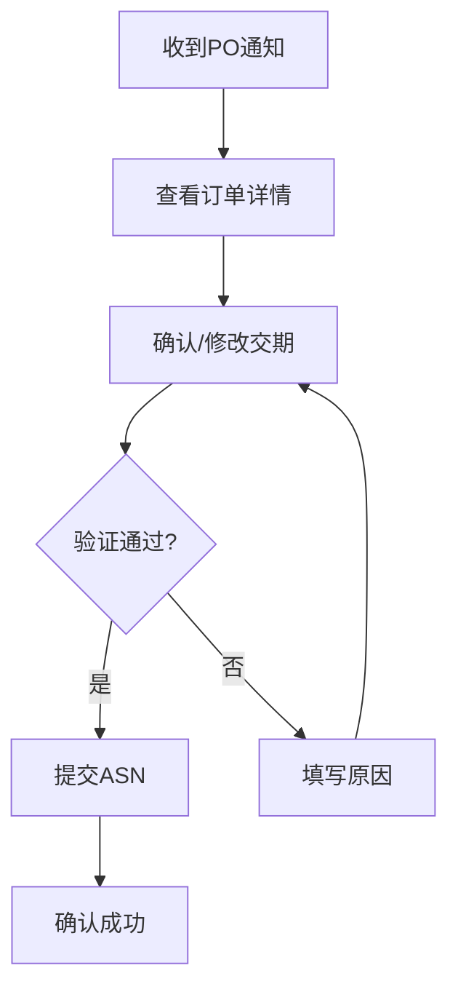

# 供应商协同门户规范

**版本**: v1.0  
**状态**: Draft  
**更新日期**: 2026-02-14  
**适用范围**: HJ_SCM 供应商协同模块  

---

## 1. 功能矩阵

| 功能 | PC端 | 移动端 | 优先级 |
|------|------|--------|--------|
| PO查看 | ✅ | ✅ | P0 |
| 交期确认 | ✅ | ✅ | P0 |
| ASN上传 | ✅ | ✅ | P0 |
| 质检报告 | ✅ | ✅ | P0 |
| 绩效看板 | ✅ | ✅ | P1 |
| 消息通知 | ✅ | ✅ | P1 |

---

## 2. 移动端交互规范

### 2.1 ASN 确认流程

### 2.2 移动端布局要求

| 元素 | 规范 |
|------|------|
| 按钮高度 | ≥44px |
| 文字大小 | ≥14px |
| 触控区域 | ≥44px |
| 表单间距 | ≥16px |

---

## 3. 安全规范

| 控制点 | 要求 |
|--------|------|
| 登录超时 | 30分钟无操作自动退出 |
| 密码策略 | 8位+大小写+数字 |
| 敏感操作 | 短信验证码确认 |
| 数据传输 | HTTPS + AES加密 |

---

## 4. 业务验收标准

| 场景 | 验收条件 |
|------|----------|
| ASN确认 | 供应商24h内确认PO交期 |
| 质检上传 | 支持PDF/图片格式质检报告 |
| 绩效看板 | 实时显示OTD/质量评分 |

---

**文档维护**: 业务专家  
**当前版本**: v1.0  
**更新日期**: 2026-02-14
