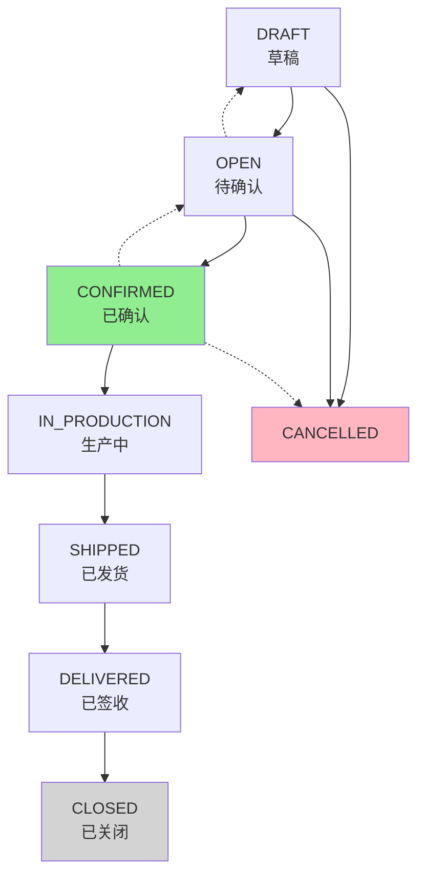
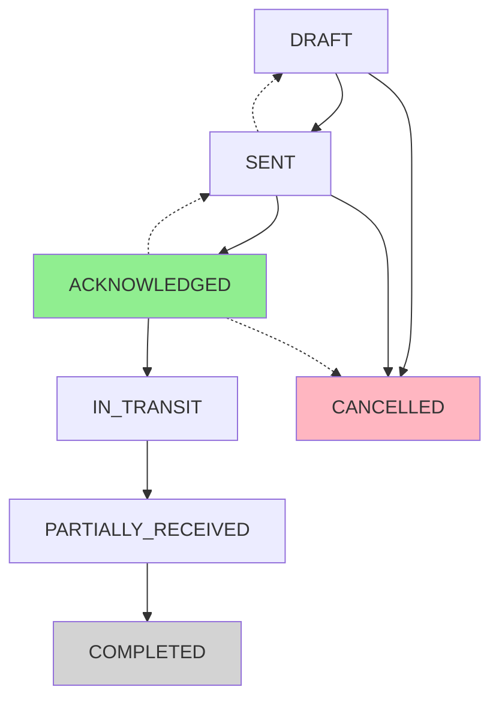
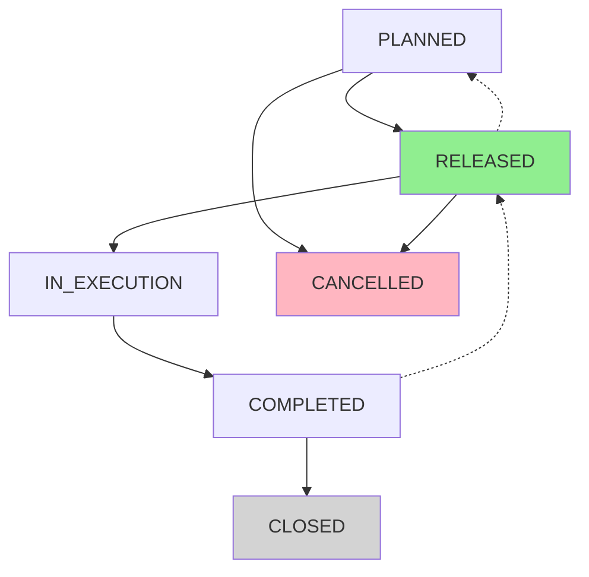

# 核心单据状态机与事件清单规范

**文档版本**: v1.0  
**状态**: Draft  
**生效日期**: 2026-02-14  
**适用范围**: HJ_SCM 平台全部核心单据  

---

## 1. 概述

### 1.1 文档目的

本文档定义 HJ_SCM 平台五大核心单据的状态机模型、状态流转规则、事件类型定义，作为状态机引擎实现、业务流程规范、测试用例设计的唯一数据来源。

### 1.2 适用范围

| 单据类型 | 单据代码 | 优先级 |
|----------|----------|--------|
| 销售订单 | SO | P0 |
| 采购订单 | PO | P0 |
| 生产工单 | MO | P0 |
| 收货单 | GR | P0 |
| 交货单 | DN | P0 |

---

## 2. 状态机设计原则

### 2.1 通用状态属性

| 属性 | 说明 |
|------|------|
| **状态名称** | 状态的业务含义名称 |
| **状态代码** | 状态的技术标识（大写下划线） |
| **是否终态** | 标识是否可以继续流转 |
| **是否可逆** | 标识是否可以回退到前序状态 |
| **权限要求** | 执行该状态变更所需的最小权限 |

### 2.2 通用事件属性

| 属性 | 说明 |
|------|------|
| **事件名称** | 事件的业务含义名称 |
| **事件代码** | 事件的技术标识（大写下划线） |
| **触发条件** | 触发该事件的业务条件 |
| **执行动作** | 触发该事件时执行的后续动作 |
| **前置状态** | 触发该事件的前置状态要求 |

---

## 3. 销售订单（SO）状态机

### 3.1 状态定义

| 状态名称 | 状态代码 | 终态 | 可逆 | 权限要求 |
|----------|----------|------|------|----------|
| 草稿 | DRAFT | 否 | 是 | 销售员 |
| 待确认 | OPEN | 否 | 是 | 销售员 |
| 已确认 | CONFIRMED | 否 | 是 | 销售经理 |
| 生产中 | IN_PRODUCTION | 否 | 否 | 系统自动 |
| 已发货 | SHIPPED | 否 | 否 | 仓库管理员 |
| 已签收 | DELIVERED | 否 | 否 | 客户 |
| 已关闭 | CLOSED | 是 | 否 | 销售员 |

### 3.2 状态流转图

### 3.3 事件定义

| 事件名称 | 事件代码 | 触发时机 | 前置状态 | 执行动作 |
|----------|----------|----------|----------|----------|
| 创建订单 | EVT_SO_CREATE | 用户点击"新建订单" | 无 | 生成订单号 |
| 提交确认 | EVT_SO_SUBMIT | 用户点击"提交" | DRAFT | 状态→OPEN |
| 确认订单 | EVT_SO_CONFIRM | 客户/经理确认 | OPEN | 状态→CONFIRMED |
| 开始生产 | EVT_SO_START_MO | 系统触发 | CONFIRMED | 创建MO |
| 发货确认 | EVT_SO_SHIP | 仓库确认发货 | IN_PRODUCTION | 状态→SHIPPED |
| 客户签收 | EVT_SO_RECEIVE | 客户确认签收 | SHIPPED | 状态→DELIVERED |
| 关闭订单 | EVT_SO_CLOSE | 财务确认完成 | DELIVERED | 状态→CLOSED |
| 取消订单 | EVT_SO_CANCEL | 用户取消 | DRAFT/OPEN/CONFIRMED | 状态→CANCELLED |

---

## 4. 采购订单（PO）状态机

### 4.1 状态定义

| 状态名称 | 状态代码 | 终态 | 可逆 | 权限要求 |
|----------|----------|------|------|----------|
| 草稿 | DRAFT | 否 | 是 | 采购员 |
| 已发送 | SENT | 否 | 是 | 采购员 |
| 已确认 | ACKNOWLEDGED | 否 | 是 | 供应商 |
| 在途中 | IN_TRANSIT | 否 | 否 | 系统自动 |
| 部分收货 | PARTIALLY_RECEIVED | 否 | 否 | 系统自动 |
| 已完成 | COMPLETED | 是 | 否 | 系统自动 |
| 已取消 | CANCELLED | 是 | 否 | 采购员 |

### 4.2 状态流转图

### 4.3 事件定义

| 事件名称 | 事件代码 | 触发时机 | 前置状态 | 执行动作 |
|----------|----------|----------|----------|----------|
| 创建PO | EVT_PO_CREATE | MRP生成/手动创建 | 无 | 生成PO号 |
| 发送PO | EVT_PO_SEND | 供应商确认发送 | DRAFT | 状态→SENT |
| 确认PO | EVT_PO_ACK | 供应商门户确认 | SENT | 状态→ACKNOWLEDGED |
| 发货通知 | EVT_PO_SHIP | 供应商发货 | ACKNOWLEDGED | 状态→IN_TRANSIT |
| 部分收货 | EVT_PO_PARTIAL | GR部分创建 | IN_TRANSIT | 状态→PARTIALLY_RECEIVED |
| 完全收货 | EVT_PO_RECEIVE | 最后GR创建 | PARTIALLY_RECEIVED | 状态→COMPLETED |
| 取消PO | EVT_PO_CANCEL | 采购员取消 | DRAFT/SENT/ACKNOWLEDGED | 状态→CANCELLED |

---

## 5. 生产工单（MO）状态机

### 5.1 状态定义

| 状态名称 | 状态代码 | 终态 | 可逆 | 权限要求 |
|----------|----------|------|------|----------|
| 已计划 | PLANNED | 否 | 是 | 计划员 |
| 已下达 | RELEASED | 否 | 是 | 车间主管 |
| 执行中 | IN_EXECUTION | 否 | 否 | 系统自动 |
| 已完工 | COMPLETED | 否 | 否 | 车间主管 |
| 已关闭 | CLOSED | 是 | 否 | 财务 |

### 5.2 状态流转图

---

## 6. 收货单（GR）状态机

| 状态名称 | 状态代码 | 终态 | 可逆 | 权限要求 |
|----------|----------|------|------|----------|
| 草稿 | DRAFT | 否 | 是 | 仓库员 |
| 已核对 | VERIFIED | 否 | 是 | 质检员 |
| 已过账 | POSTED | 是 | 否 | 财务 |
| 已关闭 | CLOSED | 是 | 否 | 系统 |

---

## 7. 交货单（DN）状态机

| 状态名称 | 状态代码 | 终态 | 可逆 | 权限要求 |
|----------|----------|------|------|----------|
| 草稿 | DRAFT | 否 | 是 | 仓库员 |
| 已拣货 | PICKED | 否 | 是 | 仓库员 |
| 已包装 | PACKED | 否 | 否 | 仓库员 |
| 已发货 | SHIPPED | 否 | 否 | 物流商收 | DELIVER |
| 已签ED | 是 | 否 | 客户 |

---

## 8. 事件总线集成

### 8.1 下游联动规则

| 事件类型 | 触发下游动作 | 联动系统 |
|----------|--------------|----------|
| EVT_SO_CONFIRM | 触发MRP计算 | MRP服务 |
| EVT_PO_ACK | 更新供应商绩效 | 绩效服务 |
| EVT_GR_POST | 自动入库 | 库存服务 |
| EVT_MO_RELEASE | 触发领料单 | WMS服务 |
| EVT_SO_SHIP | 更新ATP | 库存服务 |

---

**文档维护**: 高级架构师  
**当前版本**: v1.0  
**更新日期**: 2026-02-14
