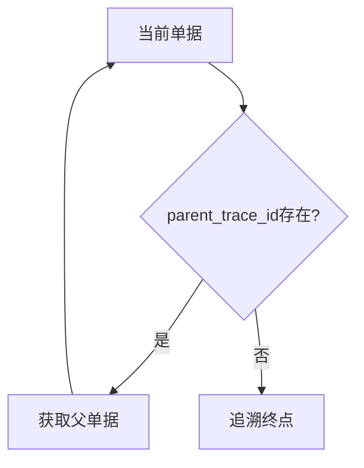
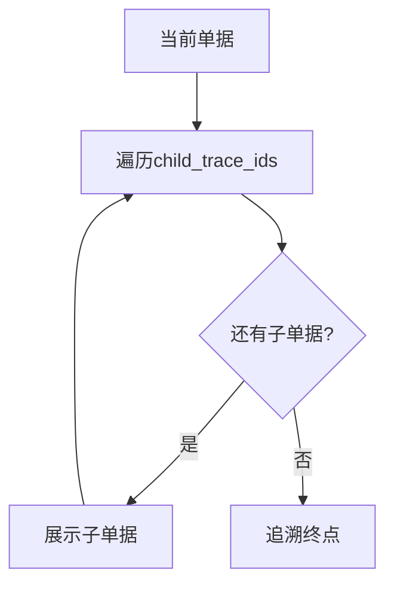

# 全链路 Trace ID 规范

**文档版本**: v1.0  
**状态**: Draft  
**生效日期**: 2026-02-14  
**适用范围**: HJ_SCM 平台全部业务单据  

---

## 1. 概述

### 1.1 Trace ID 定义

Trace ID（追溯标识）是 HJ_SCM 平台用于实现全链路业务追溯的唯一标识符。每个业务单据在创建时自动生成，且与上下游单据形成父子关联关系。

### 1.2 核心价值

| 价值点 | 说明 |
|--------|------|
| **全链路追溯** | 从任意单据可追溯上下游所有关联单据 |
| **变更影响分析** | 需求变更时自动识别受影响的全部单据 |
| **审计合规** | 满足医养产品批次追溯法规要求 |
| **问题定位** | 快速定位异常根因与影响范围 |

---

## 2. Trace ID 数据结构

### 2.1 核心字段

```typescript
interface TraceId {
  trace_id: string;              // UUID v4
  document_type: DocumentType;    // 单据类型枚举
  document_id: string;           // 单据业务编号
  parent_trace_id: string | null; // 父单据Trace ID
  child_trace_ids: string[];       // 子单据Trace ID列表
  relation_type: RelationType;    // ROOT/DERIVED_FROM/TRIGGERED_BY
  created_at: Date;
  created_by: string;
}
```

### 2.2 枚举定义

```typescript
enum DocumentType {
  SO = 'SO',   // 销售订单
  PO = 'PO',   // 采购订单
  MO = 'MO',   // 生产工单
  GR = 'GR',   // 收货单
  DN = 'DN',   // 交货单
}

enum RelationType {
  ROOT = 'ROOT',
  DERIVED_FROM = 'DERIVED_FROM',
  TRIGGERED_BY = 'TRIGGERED_BY',
}
```

---

## 3. Trace ID 生成规则

### 3.1 生成算法

```typescript
class TraceIdGenerator {
  generate(
    documentType: DocumentType,
    documentId: string,
    parentTraceId?: string
  ): TraceId {
    const relationType = parentTraceId 
      ? RelationType.DERIVED_FROM 
      : RelationType.ROOT;
    
    return {
      trace_id: uuidv4(),
      document_type: documentType,
      document_id: documentId,
      parent_trace_id: parentTraceId || null,
      child_trace_ids: [],
      relation_type: relationType,
      created_at: new Date(),
      created_by: currentUser.id,
    };
  }
}
```

---

## 4. 追溯查询规范

### 4.1 正向追溯（来源追踪）



### 4.2 反向追溯（影响追踪）



---

## 5. 性能优化策略

### 5.1 索引设计

| 索引类型 | 索引字段 | 用途 |
|----------|----------|------|
| 主键索引 | trace_id | 唯一查询 |
| 单据索引 | document_type + document_id | 单据查询 |
| 父子索引 | parent_trace_id | 层级查询 |
| 时间索引 | created_at | 范围查询 |

### 5.2 查询性能要求

| 查询类型 | 响应时间 | 数据量级 |
|----------|----------|----------|
| 单Trace查询 | < 100ms | 任意 |
| 链路追溯 | < 3s | 百万级 |
| 批量查询 | < 5s | 1000条 |

---

**文档维护**: 高级架构师  
**当前版本**: v1.0  
**更新日期**: 2026-02-14
